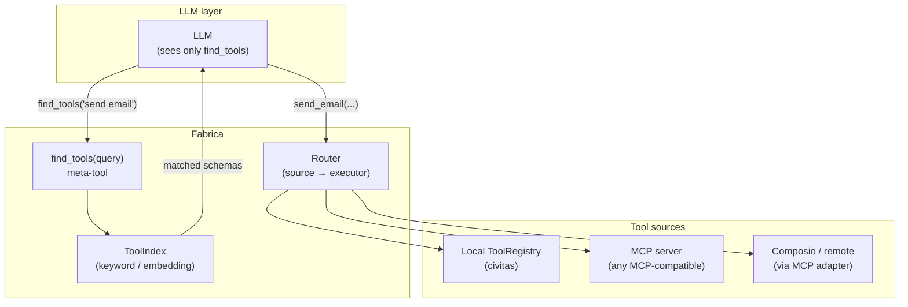

# Design: Fabrica

**Status:** Pre-alpha — specification phase
**Author:** Jeryn Mathew Varghese
**Last updated:** 2026-04
**RFC:** [0001 — Selective Tool Retrieval](../../rfcs/0001-tool-retrieval.md)

---

## Motivation

Every LLM API call that includes tools pays token cost for the full schema of every registered tool — regardless of whether the LLM uses them. At 50 tools with ~300 tokens per schema, that is 15,000 tokens of schema overhead on every call, before a single user message.

Fabrica solves this by exposing one `find_tools(query)` meta-tool to the LLM. The LLM retrieves only the schemas it needs, on demand. The full problem statement and proposed interface standard is in [RFC 0001](../../rfcs/0001-tool-retrieval.md).

**What Fabrica is not:** a replacement for MCP, Composio, or any tool source. It is the retrieval and routing layer that sits above them — framework-agnostic, source-agnostic.

---

## Architecture



Fabrica runs as a supervised `GenServer` inside a Civitas deployment, or as a standalone process reachable via MCP. Both modes expose the same interface — the LLM never knows which mode is in use.

---

## Core interfaces

### ToolSource protocol

Any tool source implements this protocol. Fabrica aggregates one or more sources.

```python
from typing import Protocol
from fabrica.types import ToolSchema, ToolResult

class ToolSource(Protocol):
    """A backend that provides tools to Fabrica."""

    @property
    def name(self) -> str:
        """Unique source identifier (e.g. 'local', 'mcp://github', 'composio')."""
        ...

    async def list_tools(self) -> list[ToolSchema]:
        """Return all tool schemas from this source. Called at startup and on refresh."""
        ...

    async def call_tool(self, name: str, params: dict) -> ToolResult:
        """Execute a tool by name with the given parameters."""
        ...

    async def health_check(self) -> bool:
        """Return False if the source is unreachable. Triggers circuit breaker."""
        ...
```

### ToolSchema

Normalised schema shared across all sources and all LLM API formats.

```python
from dataclasses import dataclass

@dataclass
class ToolSchema:
    name: str                      # unique within Fabrica's namespace
    description: str               # used for retrieval ranking
    source: str                    # which ToolSource registered this tool
    input_schema: dict             # JSON Schema for parameters
    tags: list[str]                # optional capability tags for filtering
    version: str = "1.0.0"        # semver — used for cache invalidation
```

### ToolIndex

The retrieval layer. Decoupled from storage — backends are swappable.

```python
class ToolIndex:
    """Maintains a searchable index over registered tool schemas."""

    def register(self, schema: ToolSchema) -> None: ...
    def deregister(self, name: str) -> None: ...
    def search(self, query: str, limit: int = 5) -> list[ToolSchema]: ...
    def get(self, name: str) -> ToolSchema | None: ...
```

Two backends:

| Backend | Extra | Algorithm | When to use |
|---------|-------|-----------|-------------|
| `KeywordBackend` | none (default) | BM25 over name + description | Small-medium tool sets, no vector DB |
| `EmbeddingBackend` | `fabrica[search]` | Dense cosine similarity | Large sets, fuzzy/cross-domain queries |

---

## The find_tools meta-tool

This is the only tool schema Fabrica sends to the LLM. It is generated dynamically from the registered tool set.

```python
FIND_TOOLS_SCHEMA = {
    "name": "find_tools",
    "description": (
        "Search for available tools by capability. Returns matching tool schemas. "
        "Always call this before using a tool you haven't retrieved in this session."
    ),
    "input_schema": {
        "type": "object",
        "properties": {
            "query": {
                "type": "string",
                "description": "Natural language description of what you want to do",
            },
            "limit": {
                "type": "integer",
                "description": "Maximum tools to return (default 5, max 20)",
                "default": 5,
            },
        },
        "required": ["query"],
    },
}
```

When the LLM calls `find_tools`, Fabrica searches the index and returns matching schemas in the native format of the host LLM API (Anthropic tool use, OpenAI function calling, etc.).

---

## Request flow

### Turn 1 — tool discovery

```
LLM input:   messages + [find_tools schema]
LLM output:  tool_use(find_tools, query="send a slack message")

Fabrica:     ToolIndex.search("send a slack message", limit=5)
             → [send_slack_message schema, post_slack_thread schema]

LLM input:   tool_result([send_slack_message schema, post_slack_thread schema])
LLM output:  tool_use(send_slack_message, channel="#general", text="...")
```

### Turn 2 — tool execution

```
Fabrica:     Router.dispatch("send_slack_message", {channel: ..., text: ...})
             → ToolSource("mcp://slack").call_tool(...)
             → ToolResult(content="Message sent", is_error=False)

LLM input:   tool_result("Message sent")
LLM output:  "Done — I've sent the message to #general."
```

### Session caching

Once the LLM has retrieved a schema, Fabrica caches it for the session. Subsequent calls to the same tool skip the `find_tools` step. Cache is keyed by `(session_id, tool_name, schema_version)` — invalidated when a tool's version changes.

---

## Civitas integration

Fabrica runs as a `GenServer` child in the supervision tree. Agents interact with it via the message bus — no direct import.

```python
# topology.yaml
supervision:
  name: root
  strategy: ONE_FOR_ONE
  children:
    - name: fabrica
      type: gen_server
      module: fabrica.civitas
      class: FabricaServer
      config:
        sources:
          - type: local                    # civitas ToolRegistry
          - type: mcp
            url: mcp://localhost:3000      # any MCP server
        index_backend: keyword             # or: embedding
        session_cache_ttl: 3600

    - name: assistant
      type: agent
      module: myapp.agents
      class: AssistantAgent
```

```python
# In AssistantAgent — ask Fabrica to find tools, pass to LLM
class AssistantAgent(GenServer):
    async def handle_call(self, message: Message) -> Message | None:
        # Get the find_tools schema to pass to the LLM
        meta = await self.call("fabrica", {"op": "meta_schema"})

        result = await self.llm.chat(
            messages=[{"role": "user", "content": message.payload["input"]}],
            tools=[meta.payload["find_tools_schema"]],
            tool_handler=self._handle_tool,
        )
        return self.reply({"output": result})

    async def _handle_tool(self, name: str, params: dict) -> dict:
        result = await self.call("fabrica", {"op": "call", "tool": name, "params": params})
        return result.payload
```

---

## MCP server interface

Fabrica exposes itself as an MCP server. Any MCP-compatible LLM host can connect to it directly — no Civitas required.

```
MCP list_tools  →  returns [find_tools]  (just the meta-tool)
MCP call_tool   →  handles both find_tools (returns schemas) and direct tool calls
```

This means a Claude Desktop user, a Cursor user, or any OpenAI SDK consumer can point their MCP client at a running Fabrica instance and get selective retrieval immediately.

---

## Circuit breaker

Each `ToolSource` has a circuit breaker. If `health_check()` fails three consecutive times, the source is marked unavailable and removed from routing. Tools registered from that source are hidden from `find_tools` results until the source recovers.

```python
@dataclass
class CircuitBreaker:
    source: str
    failure_threshold: int = 3
    recovery_timeout: int = 60        # seconds before retry
    state: Literal["closed", "open", "half-open"] = "closed"
```

---

## Implementation plan

### Phase 1 — Core (v0.1)

1. `fabrica/types.py` — `ToolSchema`, `ToolResult`, `ToolSource` protocol
2. `fabrica/index/keyword.py` — `KeywordBackend` (BM25 via `rank-bm25`)
3. `fabrica/index/base.py` — `ToolIndex` with register/deregister/search/get
4. `fabrica/gateway.py` — `FabricaGateway`: source aggregation, find_tools dispatch, router
5. `fabrica/formats.py` — schema serialisation to Anthropic / OpenAI tool formats
6. Unit tests: index search, schema normalisation, format conversion

### Phase 2 — Sources (v0.1)

1. `fabrica/sources/local.py` — `LocalToolSource` (reads from a dict or list of ToolSchemas)
2. `fabrica/sources/mcp.py` — `MCPToolSource` (connects to MCP server, calls `list_tools`)
3. Circuit breaker per source
4. Session cache (`fabrica/cache.py`)
5. Integration tests: local source + MCP source round-trip

### Phase 3 — Civitas integration (v0.2)

1. `fabrica/civitas.py` — `FabricaServer(GenServer)` — Civitas-native wrapper
2. Topology YAML support
3. Civitas `ToolRegistry` as a `LocalToolSource`
4. `civitas[fabrica]` extra in python-civitas

### Phase 4 — Embedding backend + MCP server (v0.2)

1. `fabrica/index/embedding.py` — `EmbeddingBackend` (sentence-transformers)
2. `fabrica/mcp_server.py` — expose Fabrica itself as an MCP server
3. `fabrica[search]` extra: `sentence-transformers`, `numpy`
4. `fabrica[mcp]` extra: `mcp>=1.0`

---

## Dependencies

| Extra | Installs | Enables |
|-------|----------|---------|
| `fabrica` (core) | `civitas>=0.1`, `rank-bm25>=0.2` | Keyword retrieval, local + MCP sources |
| `fabrica[search]` | `sentence-transformers>=3.0`, `numpy>=1.26` | Embedding retrieval |
| `fabrica[mcp]` | `mcp>=1.0` | MCP server interface + MCP source |

---

## Open questions

| # | Question | Notes |
|---|----------|-------|
| Q1 | Should `find_tools` return full schemas or just names + descriptions? | Full schemas — LLM needs them to call correctly; names only would require a second retrieval step |
| Q2 | How does credential propagation work for per-user tools (OAuth)? | Deferred — needs a separate credential context RFC |
| Q3 | Should Fabrica maintain a persistent index or rebuild on startup? | Rebuild on startup (v0.1); persistent with incremental updates later |
| Q4 | How are tool name collisions across sources handled? | Namespace prefix: `source_name.tool_name` — e.g. `mcp_github.create_issue` |
| Q5 | Should embedding index be updated live as tools register/deregister? | Yes — incremental updates, not full rebuild |

---

## Acceptance criteria

- [ ] `find_tools(query)` returns relevant tool schemas from keyword search
- [ ] LLM can call a retrieved tool in the next turn without errors
- [ ] `LocalToolSource` registers tools from a dict
- [ ] `MCPToolSource` connects to an MCP server and registers its tools
- [ ] Circuit breaker disables a source after 3 consecutive health check failures
- [ ] Session cache prevents redundant `find_tools` calls for the same tool
- [ ] Schemas serialised correctly to Anthropic and OpenAI formats
- [ ] `EmbeddingBackend` returns higher recall than `KeywordBackend` on fuzzy queries
- [ ] Fabrica exposes itself as MCP server (`list_tools` returns `[find_tools]`)
- [ ] `FabricaServer(GenServer)` starts as a Civitas supervised child
- [ ] Tool name collisions across sources resolved via namespace prefix
- [ ] ≥ 20 unit tests + ≥ 5 integration tests
